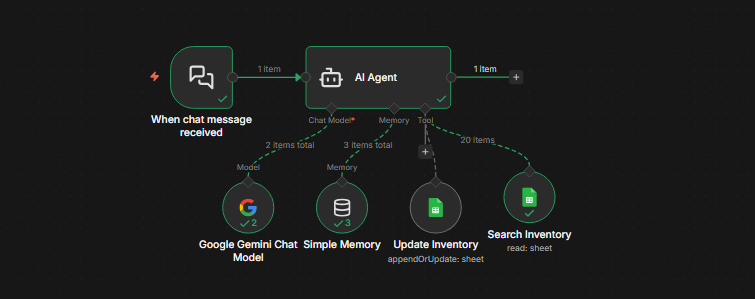

# 🤖 AI-powered workflow automation (n8n + Gemini)

This project demonstrates an **AI-powered workflow automation system** built using **n8n** and **Google Gemini LLM**.

The workflow is triggered via a **chat webhook** and uses an **AI Agent** to understand natural language user input and automatically perform actions such as **searching and updating inventory data** stored in Google Sheets.

The system acts as a **virtual inventory assistant for a general store**, enabling conversational management of stock data.

---

## 🧠 Workflow Overview

The workflow follows an **agent-based architecture** where:
- User messages are received through a chat interface
- Google Gemini LLM interprets user intent
- The AI Agent dynamically selects the appropriate tool
- Inventory data is read from or written to Google Sheets
- A response is returned to the user

---

## 📦 Inventory Data (Google Sheets)

The inventory data is maintained in **Google Sheets**, which represents **General Store stock information**.

### Example inventory fields:
- **Stock Name** (e.g., Rice, Sugar, Milk, Soap)
- **Quantity** (available units)

The AI Agent can:
- Search for existing stock items
- Update quantities of existing items
- Add new items if they do not already exist

This allows inventory to be managed using **simple chat commands**.

---

## 🛠️ Technologies Used

- **n8n** – Workflow automation and orchestration
- **Google Gemini LLM** – Natural language understanding and reasoning
- **Google Sheets** – Inventory data storage
- **AI Agent (LangChain)** – Decision-making and tool execution
- **Webhooks** – Chat-based workflow trigger

---

## 🚀 How to Use

1. Import the workflow JSON into **n8n**
2. Configure **Google Gemini API** credentials
3. Configure **Google Sheets OAuth** credentials
4. Connect the workflow to your inventory Google Sheet
5. Activate the workflow
6. Send messages via the chat webhook to interact with the inventory

---

## 💬 Example Chat Commands

- `Add 10 packets of sugar`
- `I sold 7 Bananas today`
- `Update rice quantity to 25`
- `How many soap bars are available?`
- `Check stock for milk packets`

The AI Agent will automatically interpret the request and perform the appropriate action.

---

## 🎯 Use Cases

- General store inventory management
- Conversational stock updates
- AI-driven operational automation
- Demonstration of LLM-powered workflows

---

## ⭐ Notes

- This project is built for **learning and demonstration purposes**
- Sensitive credentials are configured within n8n and are **not stored in this repository**
- The workflow can be extended to support databases, dashboards, or notifications

## ⚠️ Note: This workflow file uses placeholder values.  
- Configure your own credentials, webhook ID, and Google Sheet details in n8n before activating.

---

## 👤 Author

**Swaroop Harsh**

